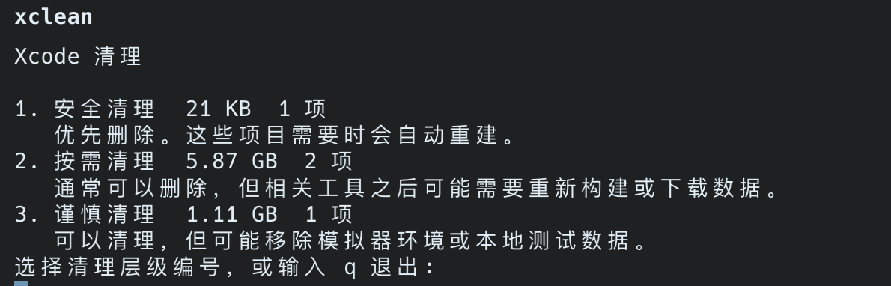

# xclean

`xclean` 是一个轻量级的 macOS Swift 命令行工具，用来交互式清理常见的 Xcode 垃圾文件。

[English README](./README.md)

## 安装

远程安装：

```bash
curl -fsSL https://pub-d400c4fab9ed43a4b869b5bd85b09934.r2.dev/xclean/install.sh | bash
```

固定到指定版本：

```bash
curl -fsSL https://pub-d400c4fab9ed43a4b869b5bd85b09934.r2.dev/xclean/install.sh | \
  XCLEAN_INSTALL_VERSION=v0.1.4 bash
```

本地开发安装：

```bash
bash install.sh
```

安装脚本会：

- 优先下载预构建的 release 压缩包
- 如果下载失败，则回退到克隆仓库并用 Swift 的 release 模式构建
- 将 `xclean` 安装到 `~/.local/bin`

你也可以覆盖默认值：

```bash
XCLEAN_RELEASE_BASE_URL=https://pub-d400c4fab9ed43a4b869b5bd85b09934.r2.dev/xclean/releases \
XCLEAN_INSTALL_VERSION=latest \
XCLEAN_REPO_URL=https://github.com/creeveliu/xclean.git \
XCLEAN_INSTALL_REF=main \
XCLEAN_INSTALL_DIR="$HOME/.local/bin" \
curl -fsSL https://pub-d400c4fab9ed43a4b869b5bd85b09934.r2.dev/xclean/install.sh | bash
```

## 用法

```bash
xclean
xclean clean
xclean scan
xclean update
xclean uninstall
xclean --version
```

`xclean update` 会重新执行安装脚本，并在当前安装目录中替换现有二进制文件。  
`xclean uninstall` 会删除当前二进制文件；如果安装目录变为空，也会一并删除该目录。

## 截图

下面是简体中文环境下的交互式清理界面：



## 交互式清理

交互式流程按清理影响来组织，而不是按 Xcode 的内部结构来分类：

- `Safe Cleanup`
  适合作为第一选择。这些条目通常是临时缓存，需要时会自动重新生成。
- `Clean If Needed`
  一般也可以安全删除，但之后某些关联文件可能需要重新构建或重新下载。
- `Careful Cleanup`
  仍然是有效的清理目标，但更适合逐项判断，因为它可能移除模拟器本地环境或测试数据。

示例：

- `DerivedData`、`UserData/Previews` 和不可用模拟器会出现在 `Safe Cleanup`
- 文档缓存、设备支持文件和日志会出现在 `Clean If Needed`
- `CoreSimulator/Devices` 会出现在 `Careful Cleanup`

每个条目都会说明：

- 它是什么
- 删除后会发生什么
- 什么时候适合清理

提示文案会自动跟随系统首选语言：

- 当首选语言以 `zh` 开头时，使用简体中文
- 其他情况使用英文

像 `DerivedData` 和 `CoreSimulator/Devices` 这样的技术名称会保持不变，以便输出仍然能清晰对应真实的 Xcode 路径。

## 清理范围

`xclean` 只会处理当前用户主目录下与 Xcode 相关的路径：

- `DerivedData`
- `DocumentationCache`
- `UserData/Previews`
- `iOS DeviceSupport`
- `tvOS DeviceSupport`
- `CoreSimulator/Devices`
- 通过 `xcrun simctl delete unavailable` 删除不可用模拟器
- 可选的日志目录

它不会触碰 archive、签名资产或 provisioning profile。

`CoreSimulator/Devices` 被列为谨慎清理目标，因为删除它可能重置模拟器设备，并移除模拟器本地的 App 数据。

## Release 打包

构建 release 压缩包：

```bash
./scripts/build-release.sh
```

压缩包会输出到 `dist/`。

发布到 GitHub Releases 时，至少需要上传：

- `xclean-macos-arm64.tar.gz`
- `xclean-macos-x86_64.tar.gz`
- 可选上传带版本号的压缩包和 `sha256sums.txt`

推送版本 tag 后会自动触发完整发布流程：

```bash
git push
git tag v0.1.4
git push origin v0.1.4
```

GitHub Actions 随后会自动：

- 创建 GitHub release
- 构建并上传 release 产物
- 合并 `sha256sums.txt`
- 同步安装脚本和 release 产物到 R2

如果需要手动执行 R2 同步，可以使用备用命令：

```bash
bash scripts/upload-r2.sh 0.1.4
```

## 发布 `curl | bash`

当前公开安装命令：

```bash
curl -fsSL https://pub-d400c4fab9ed43a4b869b5bd85b09934.r2.dev/xclean/install.sh | bash
```

当前 release 页面：

```text
https://github.com/creeveliu/xclean/releases
```

把 release 产物同步到 R2 时，建议保持安装脚本当前使用的目录结构：

```text
https://pub-d400c4fab9ed43a4b869b5bd85b09934.r2.dev/xclean/releases/latest/download/xclean-macos-arm64.tar.gz
https://pub-d400c4fab9ed43a4b869b5bd85b09934.r2.dev/xclean/releases/latest/download/xclean-macos-x86_64.tar.gz
https://pub-d400c4fab9ed43a4b869b5bd85b09934.r2.dev/xclean/releases/download/v0.1.4/xclean-macos-arm64.tar.gz
https://pub-d400c4fab9ed43a4b869b5bd85b09934.r2.dev/xclean/releases/download/v0.1.4/xclean-macos-x86_64.tar.gz
https://pub-d400c4fab9ed43a4b869b5bd85b09934.r2.dev/xclean/releases/download/v0.1.4/sha256sums.txt
```

上面的对象 key 也可以用下面这条备用命令手动上传：

```bash
bash scripts/upload-r2.sh 0.1.4
```

如果之后还要把安装入口迁移到你自己的域名，可以这样做：

1. 在稳定 URL 上托管 `install.sh`。
2. 在该脚本中把 `XCLEAN_RELEASE_BASE_URL` 设置为真实的 release 基础地址。
3. 上传名为 `xclean-macos-arm64.tar.gz` 和 `xclean-macos-x86_64.tar.gz` 的预构建压缩包。
4. 如果需要保留源码构建回退机制，可以继续保留 `XCLEAN_REPO_URL` 和 `XCLEAN_INSTALL_REF`。
5. 如果希望安装固定到某个 tag，可设置 `XCLEAN_INSTALL_VERSION=v0.1.4`。
